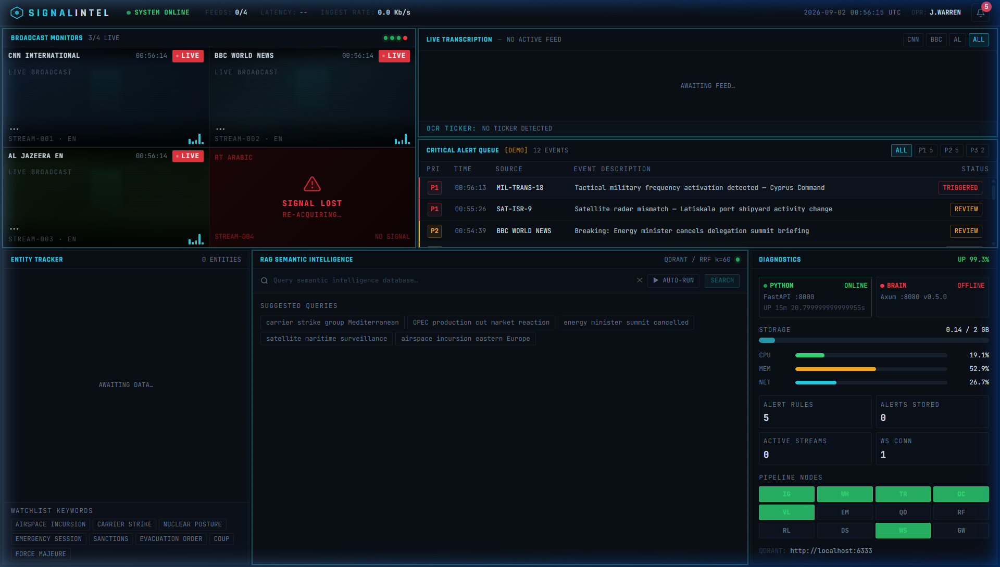
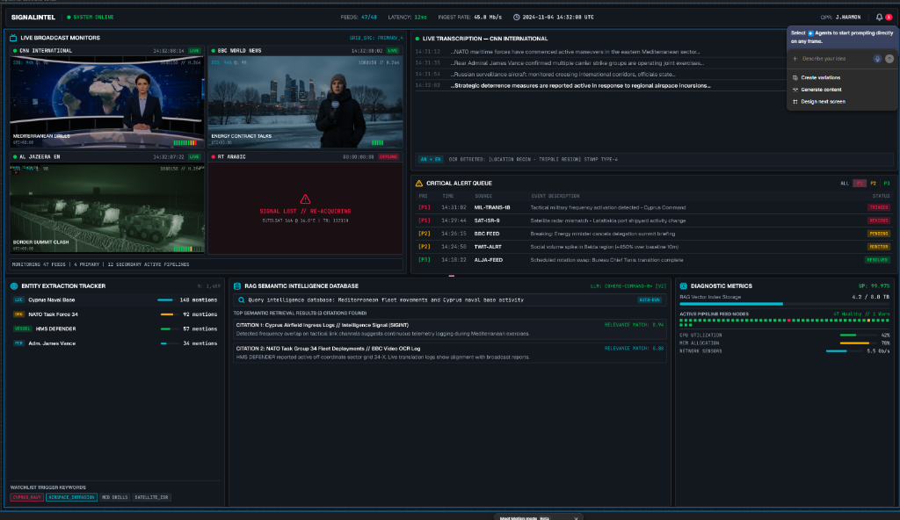

<p align="center">
  
</p>

<h1 align="center">🛰️ SignalIntel</h1>

<p align="center">
  <strong>Real-Time Broadcast Intelligence & Monitoring Platform</strong><br>
  Watch live news channels, auto-transcribe speech, detect key events, and get instant alerts.
</p>

<p align="center">
  
  
  
  
  
</p>

---

## What Is SignalIntel?

SignalIntel is a tool that watches live news broadcasts (like CNN, BBC, Al Jazeera) and automatically:

- **Transcribes** what people are saying (even in Arabic, French, etc.) and translates it to English
- **Reads on-screen text** like news tickers using OCR (optical character recognition)
- **Classifies scenes** — knows if it's a studio broadcast, a live field report, or breaking news
- **Searches** through everything it has captured using AI-powered semantic search
- **Sends you alerts** on Telegram when something important happens (like military activity or market crashes)

Everything shows up in a beautiful real-time dashboard you can watch in your browser.

---

## Screenshots

### Live Dashboard
<p align="center">
  
</p>

> The main console showing all 7 panels: video monitors, live transcription, alert queue, entity tracker, semantic search, and system diagnostics.

### Design Reference (Figma)
<p align="center">
  
</p>

> The original Figma design mockup that guided the UI implementation.

---

## How It Works (Simple Version)

```
Live TV Streams (CNN, BBC, etc.)
        │
        ▼
┌──────────────────────────┐
│  Python "Senses" (:8000) │  ← Watches streams, transcribes audio,
│  • FFmpeg captures video │    reads tickers, classifies scenes
│  • Whisper transcribes   │
│  • OCR reads tickers     │
│  • AI classifies scenes  │
└──────────┬───────────────┘
           │
           ▼
┌──────────────────────────┐
│   Rust "Brain" (:8080)   │  ← Stores everything, searches it,
│  • Qdrant vector search  │    checks alert rules, sends notifications
│  • Alert rule engine     │
│  • Telegram dispatcher   │
└──────────┬───────────────┘
           │
           ▼
┌──────────────────────────┐
│   React Dashboard (:3000)│  ← Shows everything in real-time
│  • Live video monitors   │    in your browser
│  • Scrolling transcripts │
│  • Alert queue           │
│  • Semantic search       │
└──────────────────────────┘
```

---

## Quick Start

### What You Need

Before you start, make sure you have these installed on your computer:

| Tool | Version | How to Check | Download |
|------|---------|-------------|----------|
| **Python** | 3.10 or newer | `python --version` | [python.org](https://www.python.org/downloads/) |
| **Node.js** | 18 or newer | `node --version` | [nodejs.org](https://nodejs.org/) |
| **Git** | Any recent version | `git --version` | [git-scm.com](https://git-scm.com/) |

**Optional** (for full features):
| Tool | Purpose | Download |
|------|---------|----------|
| **Rust** | Runs the Brain server | [rustup.rs](https://rustup.rs/) |
| **Docker** | One-click deployment | [docker.com](https://www.docker.com/products/docker-desktop/) |
| **Ollama** | AI scene classification | [ollama.com](https://ollama.com/) |
| **FFmpeg** | Video stream capture | [ffmpeg.org](https://ffmpeg.org/download.html) |

---

### Option 1: Run with Docker (Easiest)

If you have Docker installed, this is the fastest way:

```bash
# 1. Clone the project
git clone https://github.com/Natnael-Dev/SignalIntel.git
cd SignalIntel

# 2. Copy the example config file
cp .env.example .env

# 3. Start everything
docker compose up -d --build
```

That's it! Open **http://localhost:3000** in your browser.

To stop everything:
```bash
docker compose down
```

---

### Option 2: Run Locally (Without Docker)

#### Step 1: Clone the Project

```bash
git clone https://github.com/Natnael-Dev/SignalIntel.git
cd SignalIntel
```

#### Step 2: Set Up Python Services

```bash
# Install Python dependencies
pip install -e .

# Start the Python server
python -m uvicorn services.main:app --host 0.0.0.0 --port 8000
```

You should see:
```
INFO:     Uvicorn running on http://0.0.0.0:8000
```

#### Step 3: Set Up the Dashboard UI

Open a **new terminal window**:

```bash
# Go to the UI folder
cd SignalIntel/ui

# Install JavaScript dependencies
npm install

# Start the development server
npm run dev
```

You should see:
```
VITE ready in 500ms
➜  Local: http://localhost:5173/
```

#### Step 4: Open Your Browser

Go to **http://localhost:5173/** — you should see the SignalIntel dashboard!

> **Note:** If the Python and Rust backends aren't running, the dashboard automatically switches to **Demo Mode** with simulated data so you can still see how everything looks.

---

### Option 3: Run with Makefile (Linux/Mac)

If you're on Linux or Mac and have all tools installed:

```bash
make dev      # Start everything with Docker
make build    # Build everything locally
make test     # Run all tests
make logs     # Watch live logs
make status   # Check what's running
make clean    # Clean up everything
make help     # Show all commands
```

---

## Setting Up Telegram Alerts

Want to get instant Telegram messages when breaking news happens? Here's how:

### Step 1: Create a Telegram Bot

1. Open Telegram and search for **@BotFather**
2. Send `/newbot` and follow the instructions
3. BotFather will give you a **Bot Token** — it looks like `123456789:ABCdefGhIJKlmNoPQRsTUVwxyZ`

### Step 2: Get Your Chat ID

1. Add your bot to a Telegram group (or start a direct chat with it)
2. Send a message in the chat
3. Visit `https://api.telegram.org/bot<YOUR_TOKEN>/getUpdates` in your browser
4. Find the `chat.id` number in the response

### Step 3: Add Your Token

Edit your `.env` file (copy from `.env.example` if you don't have one):

```ini
TELEGRAM_BOT_TOKEN=123456789:ABCdefGhIJKlmNoPQRsTUVwxyZ
```

### Step 4: Restart

```bash
# If using Docker
docker compose restart

# If running locally, just restart the Rust Brain server
```

Now when SignalIntel detects keywords like "breaking news", "military exercises", or "market crash", you'll get an instant Telegram alert! 🔔

---

## Dashboard Panels Explained

### 1. 📺 Broadcast Monitors (Top Left)

A 2×2 grid showing live video feeds from 4 news channels. Each tile shows:
- Channel name and timestamp
- A red "LIVE" badge when actively receiving
- The latest caption/transcript text
- Audio activity bars
- Scene type (Studio, Field Report, Breaking News, etc.)

If a stream drops, the tile turns red with "SIGNAL LOST".

### 2. 📝 Live Transcription (Top Right)

A scrolling feed of everything being said on the broadcasts:
- Filter by channel using the tabs at the top (CNN, BBC, AL, ALL)
- Color-coded confidence scores (green = high, amber = medium, red = low)
- Translations shown in green below the original text
- Auto-scrolls to show newest content (click "↓ LIVE" to re-enable if you scroll up)
- OCR ticker crawl at the bottom showing extracted on-screen text

### 3. 🚨 Critical Alert Queue (Middle Right)

A table of triggered intelligence alerts, sorted by priority:
- **P1 (Red)** — Critical: military activity, breaking news
- **P2 (Amber)** — Important: geopolitical events, market movements
- **P3 (Green)** — Monitor: social trends, protests

Click any row to see details. Use the filter buttons to show only specific priority levels.

### 4. 🏷️ Entity Tracker (Bottom Left)

Automatically extracts named entities from transcripts:
- **LOC** (Cyan) — Locations: countries, cities, regions
- **ORG** (Amber) — Organizations: NATO, OPEC, UN
- **VESSEL** (Green) — Ships and military vessels
- **PER** (Purple) — People's names
- **MIL** (Red) — Military terms and equipment

Shows a count bar for how often each entity appears.

### 5. 🔍 RAG Semantic Search (Bottom Center)

Search through everything SignalIntel has captured using natural language:
- Type a question like "carrier strike group Mediterranean"
- Results come from Qdrant vector database with relevance scores
- **AUTO-RUN** mode re-runs your query every 8 seconds to catch new matches
- Click suggested queries for quick access

### 6. 📊 Diagnostic Metrics (Bottom Right)

System health monitoring:
- Green/Red service badges for Python and Rust backends
- CPU, Memory, and Network usage bars
- Storage usage indicator
- A 12-node pipeline grid showing which processing stages are active
- Active alert rule count and total stored alerts

---

## Project Structure

```
SignalIntel/
│
├── services/               # Python — Media Processing ("The Senses")
│   ├── main.py             #   FastAPI server & orchestrator
│   ├── ingestion/          #   FFmpeg stream capture workers
│   ├── audio/              #   Whisper ASR + translation + SRT export
│   └── vision/             #   VLM scene classification + OCR ticker extraction
│
├── crates/                 # Rust — Intelligence Engine ("The Brain")
│   ├── core/               #   Qdrant RAG client + alert rule engine
│   ├── gateway/            #   Axum HTTP server (port 8080)
│   ├── channels/           #   Telegram, Discord, WhatsApp dispatchers
│   └── ocr/                #   Tesseract OCR CLI wrapper
│
├── ui/                     # React — Intelligence Console ("The Eyes")
│   ├── src/components/     #   7 dashboard panel components
│   ├── src/hooks/          #   Real-time data hooks (WebSocket, polling)
│   ├── src/lib/            #   Demo data generator
│   └── src/types/          #   TypeScript domain models
│
├── docker/                 # Docker — Containerization
│   ├── Dockerfile.python   #   Python services container
│   ├── Dockerfile.rust     #   Rust brain container
│   ├── Dockerfile.ui       #   UI + Nginx container
│   └── nginx.conf          #   Reverse proxy configuration
│
├── docker-compose.yml      # One-click deployment orchestration
├── Makefile                # Build automation commands
├── .env.example            # Configuration template
└── README.md               # This file
```

---

## Configuration Reference

All settings go in your `.env` file (copy `.env.example` to get started):

```ini
# === Python Media Services (port 8000) ===
PORT=8000                                          # Python server port
SIGNALINTEL_VISION_MODEL=llava:7b                  # Ollama VLM model name
SIGNALINTEL_OCR_BIN=target/release/signalintel-ocr # Path to OCR binary
SIGNALINTEL_BRAIN_URL=http://127.0.0.1:8080/api/v1/ingest  # Where to send events

# === Rust Brain & Gateway (port 8080) ===
GATEWAY_PORT=8080                                  # Brain server port
QDRANT_URL=http://127.0.0.1:6333                   # Qdrant vector DB address
TELEGRAM_BOT_TOKEN=your_token_here                 # Telegram bot token for alerts

# === UI Console (port 5173 dev / 3000 production) ===
VITE_PYTHON_URL=http://localhost:8000              # Python API URL for UI
VITE_PYTHON_WS_URL=ws://localhost:8000             # WebSocket URL for live feeds
VITE_BRAIN_URL=http://localhost:8080               # Brain API URL for search/alerts
VITE_OPERATOR=J.WARREN                             # Operator name shown in top bar
```

---

## API Endpoints

### Python Services (`:8000`)

| Method | Endpoint | What It Does |
|--------|----------|-------------|
| `GET` | `/api/v1/health` | Check if Python services are running |
| `GET` | `/api/v1/streams` | See active stream capture workers |
| `WS` | `/api/v1/ws/transcripts` | Real-time transcript + vision event stream |

### Rust Brain (`:8080`)

| Method | Endpoint | What It Does |
|--------|----------|-------------|
| `GET` | `/api/v1/health` | Check if the Brain is running |
| `POST` | `/api/v1/ingest` | Send a new intelligence event |
| `GET` | `/api/v1/search?q=query` | Search through all captured data |
| `GET` | `/api/v1/alerts` | View recent triggered alerts |
| `GET` | `/api/v1/alerts/rules` | See active monitoring rules |
| `POST` | `/api/v1/alerts/rules` | Add a new keyword monitoring rule |

---

## Troubleshooting

### Dashboard shows "DEMO" mode

This is normal! The dashboard works even without backends. It shows simulated data so you can see how everything looks. To get live data, make sure:
- Python server is running on port 8000
- The dashboard is configured to connect to it (check `.env` settings)

### Port already in use

If you see "port already in use" errors:

```bash
# Windows — find and kill the process
netstat -ano | findstr :8000
taskkill /PID <process_id> /F

# Linux/Mac
lsof -i :8000
kill -9 <process_id>
```

### Rust Brain won't compile

The Rust Brain needs a C compiler for some dependencies:
- **Windows**: Install [Visual Studio Build Tools](https://visualstudio.microsoft.com/visual-cpp-build-tools/) with "C++ build tools"
- **Linux**: `sudo apt install build-essential`
- **Mac**: `xcode-select --install`

Or just skip the Rust Brain — the dashboard works fine in Demo Mode without it!

### Telegram alerts not working

1. Make sure your `TELEGRAM_BOT_TOKEN` is in `.env`
2. Make sure the bot is added to your chat/group
3. Make sure you sent at least one message in the chat first
4. Restart the Brain server after changing `.env`

---

## Tech Stack

| Layer | Technology | Purpose |
|-------|-----------|---------|
| **Media Processing** | Python 3.11, FastAPI, FFmpeg | Captures and processes live video/audio streams |
| **Speech-to-Text** | Faster-Whisper | Transcribes speech in 90+ languages |
| **Translation** | Deep-Translator | Translates non-English transcripts to English |
| **Scene Analysis** | LiteLLM + Ollama (LLaVA) | Classifies video frames using vision AI |
| **Text Extraction** | Tesseract OCR | Reads on-screen text like news tickers |
| **Vector Search** | Qdrant | Stores and searches events using AI embeddings |
| **Alert Engine** | Rust + Axum | Fast keyword matching and priority dispatch |
| **Notifications** | Telegram Bot API | Sends real-time alerts to your phone |
| **Dashboard** | React 18 + Vite + Tailwind CSS | Beautiful real-time monitoring console |
| **Deployment** | Docker + Nginx | One-click containerized deployment |

---

## License

MIT License — free to use, modify, and distribute. See [LICENSE](LICENSE) for details.
